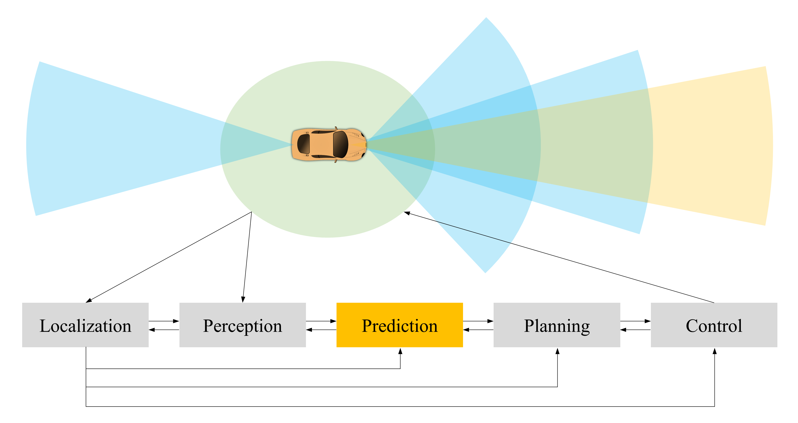

# Awesome Driving Behavior Prediction

  

This is a collection of research papers for **Driving Behavior Prediction**. The repository will be continuously updated.

  

Welcome to follow and star!

  

## Table of Contents

  

-  [An Overview of Driving Behavior Prediction](#a-Overview-of-End-to-End-Driving-Method)

-  [Dataset](#datasets)
-  [Survey](#survey)
-  [Papers](#papers)
	- [AAAI](#aaai)
	- [CVPR](#cvpr)
	- [ECCV](#eccv)
	- [NeurIPS](#nerurips)
	- [CORL](#corl)
	- [T-ITS](#t-its)
	- [ITSC](#itsc)
	- [IV](#iv)
	- [IROS](#iros)
	- [arXiv](#arxiv)
	- [Others](#others)
		- [ICRA 2019](#icra-2019)
		- [RSS 2016](#rss-2016)
		- [RAL 2021](#ral2021)
		- [PNAS 2020](#pnas-2020)
		- [IJRR 2020](#ijrr-2020)
-  [Contributing](#contributing)

  

## An Overview of Driving Behavior Prediction

  
The driving behavior prediction task aims at accurately predicting the intentions or the motions of road users (vehicles, bicycles, pedestrians, etc.), given the current and historic information of the road users and the environment. In the classic autonomous driving pipeline, the prediction task serves as a downstream task of the detection and tracking, and is closely related to planning. High-fidelity prediction is critical for safe and efficient operation of autonomous vehicles.


  
## Format


```
format:
- [title](paper link) [links]
  - author1, author2, and author3.
  - key 
  - experiment environment (optional) 
```

## Dataset

- [Large Scale Interactive Motion Forecasting for Autonomous Driving : The Waymo Open Motion Dataset](https://arxiv.org/abs/2104.10133)
	- Scott Ettinger, Shuyang Cheng, Benjamin Caine, Chenxi Liu, Hang Zhao, Sabeek Pradhan, Yuning Chai, Ben Sapp, Charles Qi, Yin Zhou, Zoey Yang, Aurelien Chouard, Pei Sun, Jiquan Ngiam, Vijay Vasudevan, Alexander McCauley, Jonathon Shlens, Dragomir Anguelov
	- key: 3D auto-labeling system, high quality 3D map
	- Dataset: Waymo
 
-  [NuPlan: A closed-loop ML-based planning benchmark for autonomous vehicles](https://arxiv.org/abs/2106.11810)
	- Holger Caesar, Juraj Kabzan, Kok Seang Tan, Whye Kit Fong, Eric Wolff, Alex Lang, Luke Fletcher, Oscar Beijbom, Sammy Omari
	- key: closed-loop ML-based planning benchmark, reactive agents
	- env: NuPlan

-  [Argoverse: 3D tracking and forecasting with rich maps](https://arxiv.org/abs/1911.02620)
	- Ming-Fang Chang, John Lambert, Patsorn Sangkloy, Jagjeet Singh, Slawomir Bak, Andrew Hartnett, De Wang, Peter Carr, Simon Lucey, Deva Ramanan, James Hays
	- key: 3D tracking, motion forecasting, forward-facing stereo imagery
	- env: Argoverse

-  [INTERACTION Dataset: An INTERnational, Adversarial and Cooperative moTION Dataset in Interactive Driving Scenarios with Semantic Maps](https://arxiv.org/abs/1910.03088)
	- Wei Zhan, Liting Sun, Di Wang, Haojie Shi, Aubrey Clausse, Maximilian Naumann, Julius Kummerle, Hendrik Konigshof, Christoph Stiller, Arnaud de La Fortelle, Masayoshi Tomizuka
	- key: urban/highway/ramp, multiple countries, highly complex behavior
	- env: INTERACTION

-  [The highD Dataset: A Drone Dataset of Naturalistic Vehicle Trajectories on German Highways for Validation of Highly Automated Driving Systems](https://arxiv.org/abs/1810.05642)
	- Robert Krajewski, Julian Bock, Laurent Kloeker, Lutz Eckstein
	- key: German highways
	- env: HighD


-  [The inD Dataset: A Drone Dataset of Naturalistic Road User Trajectories at German Intersections](https://ieeexplore.ieee.org/document/9304839)
	- Julian Bock, Robert Krajewski, Tobias Moers, Steffen Runde and etc. 
	- key: Roads, Trajectory, Drones, Predictive models, Safety, Cameras, Automobiles
	- env: inD


-  [The rounD Dataset: A Drone Dataset of Road User Trajectories at Roundabouts in Germany](https://ieeexplore.ieee.org/document/9294728)
	- Robert Krajewski, Tobias Moers, Julian Bock, Lennart Vater and etc. 
	- key: Roads, Trajectory, Drones, Videos, Sensors, Task analysis, Tracking
	- env: rounD


## Survey

-  [Social Interactions for Autonomous Driving: A Review and Perspectives](https://arxiv.org/abs/2208.07541)
	- Wenshuo Wang, Letian Wang, Chengyuan Zhang, Changliu Liu, Lijun Sun
	- key: foundation and trends in robotics

-  [Human motion trajectory prediction: a survey](https://arxiv.org/abs/1905.06113)
	- Andrey Rudenko, Luigi Palmieri, Michael Herman, Kris M. Kitani, Dariu M. Gavrila, Kai O. Arras
	- key: international journal of robotics research

-  [Deep learning-based vehicle behavior prediction for autonomous driving applications: a review](https://arxiv.org/abs/1912.11676)
	- Sajjad Mozaffari, Omar Y. Al-Jarrah, Mehrdad Dianati, Paul Jennings, Alexandros Mouzakitis
	- key: IEEE transactions on intelligent transportation systems

## Paper

### AAAI

-  [Online Adaptation of Neural Network Models by Modified Extended Kalman Filter for Customizable and Transferable Driving Behavior Prediction](https://arxiv.org/abs/2112.06129) (**<font color="red">Ours!!!</font>**)
	- Letian Wang, Yeping Hu, Changliu Liu
	- Key: adaptability, evaluation metrics

### CVPR

-  [Trafficpredict: Trajectory prediction for heterogeneous traffic-agents](https://arxiv.org/abs/1811.02146)
	- Yuexin Ma, Xinge Zhu, Sibo Zhang, Ruigang Yang, Wenping Wang, Dinesh Manocha
	- Key: category-aware 4D graph
	- env: [Apolloscape Trajectory](https://paperswithcode.com/dataset/apolloscape-trajectory)

-  [MultiPath++: Efficient Information Fusion and Trajectory Aggregation for Behavior Prediction](https://arxiv.org/abs/2111.14973)
	- Balakrishnan Varadarajan, Ahmed Hefny, Avikalp Srivastava, Khaled S. Refaat, Nigamaa Nayakanti, Andre Cornman, Kan Chen, Bertrand Douillard, Chi Pang Lam, Dragomir Anguelov, Benjamin Sapp
	- Key: interaction among road elements, state representation, ensembling
	- env: [Argoverse](https://paperswithcode.com/dataset/argoverse)


-  [Multimodal Motion Prediction with Stacked Transformers](https://arxiv.org/abs/2103.11624)
	- Yicheng Liu, Jinghuai Zhang, Liangji Fang, Qinhong Jiang, Bolei Zhou
	- Key: transformer, trajectory proposal, region-based prediction
	- env: [Argoverse](https://paperswithcode.com/dataset/argoverse)


-  [VectorNet: Encoding HD maps and agent dynamics from vectorized representation](https://arxiv.org/abs/2005.04259)
	- Jiyang Gao, Chen Sun, Hang Zhao, Yi Shen, Dragomir Anguelov, Congcong Li, Cordelia Schmid
	- Key: Vectorized graph representation of the environment
	- env: [Argoverse](https://paperswithcode.com/dataset/argoverse)

-  [TITAN: Future forecast using action priors](https://arxiv.org/abs/2003.13886)
	- Srikanth Malla, Behzad Dariush, Chiho Choi
	- Key: action prior
	- env: [TITAN](https://paperswithcode.com/dataset/titan), [Kinetics (Kinetics Human Action Video Dataset)](https://paperswithcode.com/dataset/kinetics)


-  [PRECOG: Prediction conditioned on goals in visual multi-agent settings](https://arxiv.org/abs/1905.01296)
	- Nicholas Rhinehart, Rowan McAllister, Kris Kitani, Sergey Levine
	- Key: goal-conditioned, visual input
	- env: [nuScenes](https://paperswithcode.com/dataset/nuscenes), [CARLA](https://paperswithcode.com/dataset/carla)


-  [Social GAN: Socially Acceptable Trajectories with Generative Adversarial Networks](https://arxiv.org/abs/1803.10892)
	- Agrim Gupta, Justin Johnson, Li Fei-Fei, Silvio Savarese, Alexandre Alahi
	- Key: social interaction, GAN
	- env: [ETH](https://paperswithcode.com/dataset/eth)

-  [Neighborhood LSTM : Human trajectory Prediction in Crowded Spaces](https://cvgl.stanford.edu/papers/CVPR16_Social_LSTM.pdf)
	- Alahi, Alexandre & Goel, Kratarth & Ramanathan, Vignesh & Robicquet, Alexandre & Fei-Fei, Li & Savarese, Silvio.
	- Key: social pooling, LSTM

-  [EvolveGraph: Multi-Agent Trajectory Prediction with Dynamic Relational Reasoning](https://arxiv.org/abs/2003.13924)
	- Jiachen Li, Fan Yang, Masayoshi Tomizuka, Chiho Choi
	- Key: GNN, heterogeneous
	- Dataset: H3D (https://paperswithcode.com/dataset/h3d)

-  [TNT: Target-driveN Trajectory Prediction](https://arxiv.org/abs/2008.08294)
	- Hang Zhao, Jiyang Gao, Tian Lan, Chen Sun, Benjamin Sapp, Balakrishnan Varadarajan, Yue Shen, Yi Shen, Yuning Chai, Cordelia Schmid, Congcong Li, Dragomir Anguelov
	- Key: target-based trajectory proposal, training a scorer
	- Dataset: [Argoverse](https://paperswithcode.com/dataset/argoverse), INTERACTION Dataset (included above)

-  [DROGON: A Trajectory Prediction Model based on Intention-Conditioned Behavior Reasoning](https://proceedings.mlr.press/v155/choi21a/choi21a.pdf)
	- Chiho Choi, Srikanth Malla, Abhishek Patil, Joon Hee Choi
	- Key: intention-conditioned, graph
	- Dataset: [KITTI](https://paperswithcode.com/dataset/kitti), [UCY](https://paperswithcode.com/dataset/ucy)


### ECCV
-  [Trajectron++: Dynamically-Feasible Trajectory Forecasting with Heterogeneous Data](https://arxiv.org/abs/2001.03093)
	- Tim Salzmann, Boris Ivanovic, Punarjay Chakravarty, Marco Pavone
	- Key: GNN, dynamic feasibility
	- Dataset: [ETH](https://paperswithcode.com/dataset/eth), [nuScenes](https://paperswithcode.com/dataset/nuscenes)


### NeurIPS 

-  [Hierarchical Adaptable and Transferable Networks (HATN) for Driving Behavior Prediction](https://arxiv.org/abs/2111.00788) (**<font color="red">Ours!!!</font>**)
	- Letian Wang, Yeping Hu, Liting Sun, Wei Zhan, Masayoshi Tomizuka, Changliu Liu
	- Key: hierarchical training, scenario-transferability
	- Dataset: INTERACTION Dataset (included above)

-  [Multiple Futures Prediction](https://arxiv.org/abs/1911.00997)
	- Yichuan Charlie Tang, Ruslan Salakhutdinov
	- Key: graph, multi-modal
	- Dataset: [Argoverse](https://paperswithcode.com/dataset/argoverse), [CARLA](https://paperswithcode.com/dataset/carla)


### CORL
-  [MultiPath: Multiple Probabilistic Anchor Trajectory Hypotheses for Behavior Prediction](https://arxiv.org/abs/1910.05449)
	- Yuning Chai, Benjamin Sapp, Mayank Bansal, Dragomir Anguelov
	- Key: proposal anchors, anchor-conditioned prediction

### T-ITS
-  [Scenario-Transferable Semantic Graph Reasoning for Interaction-Aware Probabilistic Prediction](https://arxiv.org/abs/2004.03053)
	- Yeping Hu, Wei Zhan, Masayoshi Tomizuka
	- Key: scenario-transferability, GNN

-  [Naturalistic driver intention and path prediction using recurrent neural networks](https://arxiv.org/abs/1807.09995)
	- Alex Zyner, Stewart Worrall, Eduardo Nebot
	- Key: intention in roundabouts

-  [How Would Surround Vehicles Move? A Unified Framework for Maneuver Classification and Motion Prediction](https://arxiv.org/abs/1801.06523)
	- Nachiket Deo, Akshay Rangesh, Mohan M. Trivedi
	- Key: optimization-based method, maneuver classification and prediction

### ITSC
-  [GRIP++: Enhanced Graph-based Interaction-aware Trajectory Prediction for Autonomous Driving](https://arxiv.org/abs/1907.07792)
	- Xin Li, Xiaowen Ying, Mooi Choo Chuah
	- Key: population and convolution on graph
	
-  [Relational Recurrent Neural Networks For Vehicle Trajectory Prediction](https://hal.inria.fr/hal-02195180/document)
	- Kaouther Messaoud, Itheri Yahiaoui, Anne Verroust-Blondet, Fawzi Nashashibi
	- Key: occupancy map

-  [A framework for probabilistic generic traffic scene prediction](https://arxiv.org/abs/1810.12506)
	- Yeping Hu, Wei Zhan, Masayoshi Tomizuka
	- Key: GMM, generic insertion on highway, probabilistic prediction

-  [Multiple Model Unscented Kalman Filtering in Dynamic Bayesian Networks for Intention Estimation and Trajectory Prediction](https://ieeexplore.ieee.org/document/8569932)
	- Jens Schulz; Constantin Hubmann; Julian Löchner; Darius Burschka and etc.
	- Key: Dynamic Bayesian network

-  [Probabilistic Prediction of Interactive Driving Behavior via Hierarchical Inverse Reinforcement Learning](https://arxiv.org/abs/2204.13683)
	- Liting Sun, Wei Zhan, Masayoshi Tomizuka
	- Key: decision hierarchy, inverse reinforcement learning


### IV
-  [Data Driven Prediction Architecture for Autonomous Driving and its Application on Apollo Platform](https://arxiv.org/abs/2006.06715)
	- Kecheng Xu, Xiangquan Xiao, Jinghao Miao, Qi Luo
	- Key: Baidu, architecture

-  [Multi-modal probabilistic prediction of interactive behavior via an interpretable model](https://arxiv.org/abs/1903.09381)
	- Yeping Hu, Wei Zhan, Liting Sun, Masayoshi Tomizuka
	- Key: probabilistic prediction, multi-modality

-  [AGen: Adaptable generative prediction networks for autonomous driving](https://www.cs.cmu.edu/~cliu6/files/iv19-1.pdf)
	- Wenwen Si; Tianhao Wei; Changliu Liu
	- Key: adaptability, GAN

-  [Probabilistic Prediction of Vehicle Semantic Intention and Motion](https://arxiv.org/abs/1804.03629)、
	- Yeping Hu, Wei Zhan, Masayoshi Tomizuka
	- Key: generic representation, probabilistic

-  [Multi-Modal Trajectory Prediction of Surrounding Vehicles with Maneuver based LSTMs](https://arxiv.org/abs/1805.05499)
	- Nachiket Deo, Mohan M. Trivedi
	- Key: maneuver-aware LSTM

-  [Sequence-to-Sequence Prediction of Vehicle Trajectory via LSTM Encoder-Decoder Architecture](https://arxiv.org/abs/1802.06338)
	- Seong Hyeon Park, ByeongDo Kim, Chang Mook Kang, Chung Choo Chung, Jun Won Choi
	- Key: occupancy map

### IROS
-  [Courteous Autonomous Cars](https://arxiv.org/abs/1808.02633)
	- Liting Sun, Wei Zhan, Masayoshi Tomizuka, Anca D. Dragan
	- Key: driving style, IRL

-  [Conditional Generative Neural System for Probabilistic Trajectory Prediction](https://arxiv.org/abs/1905.01631)
	- Jiachen Li, Hengbo Ma, Masayoshi Tomizuka
	- Key: VAE, GAN, contextual-interactive-feasible-probablistic prediction
	- Dataset: [ETH](https://paperswithcode.com/dataset/eth)


### arXiv

-  [Transferable and Adaptable Driving Behavior Prediction](https://arxiv.org/abs/2202.05140)(**<font color="red">Ours!!!</font>**)
	- Letian Wang, Yeping Hu, Liting Sun, Wei Zhan, Masayoshi Tomizuka, Changliu Liu
	- Key: Scenario-transferability, Individual-adaptability
	- Dataset: INTERACTION Dataset (included above)

- [Accelerating Reinforcement Learning for Autonomous Driving using Task-Agnostic and Ego-Centric Motion Skills](https://arxiv.org/abs/2209.12072)(**<font color="red">Ours!!!</font>**)
	- Tong Zhou, Letian Wang, Ruobing Chen, Wenshuo Wang, Yu Liu
	- Key: continuous space exploration, motion primitive, driving skill distillation
	- Dataset: [MetaDrive](https://metadriveweb.com/)

### Others


#### RAL 2021
-  [Socially-Compatible Behavior Design of Autonomous Vehicles with Verification on Real Human Data](https://arxiv.org/abs/2010.14712)(**<font color="red">Ours!!!</font>**)
	- Letian Wang, Liting Sun, Masayoshi Tomizuka, Wei Zhan
	- Key: driving style, game theory, Bayesian inference


#### PNAS 2020
-  [Social behavior for autonomous vehicles](https://www.pnas.org/doi/abs/10.1073/pnas.1820676116)
	- Wilko Schwarting, Javier Alonso-Mora， Daniela RusAuthors
	- Key: driving style, social interaction, SVO


#### IJRR 2020
-  [Multimodal interaction-aware motion prediction for autonomous street crossing](https://arxiv.org/abs/1808.06887)
	- Noha Radwan, Wolfram Burgard, Abhinav Valada
	- Key: predict passing order, deployed on real vehicles

#### ICRA 2019
-  [Long-term occupancy grid prediction using recurrent neural networks](https://arxiv.org/abs/1809.03782)
	- Marcel Schreiber, Stefan Hoermann, Klaus Dietmayer
	- Key: occupancy map, LSTM

-  [Predicting vehicle behaviors over an extended horizon using behavior interaction network](https://arxiv.org/abs/1903.00848)
	- Wenchao Ding, Jing Chen, Shaojie Shen
	- Key: pair-wise interaction modeling

-  [Uncertainty-aware driver trajectory prediction at urban intersections](https://arxiv.org/abs/1901.05105)
	- Xin Huang, Stephen McGill, Brian C. Williams, Luke Fletcher, Guy Rosman
	- Key: Confidence-aware, image input

#### RSS 2016
-  [Planning for autonomous cars that leverage effects on human actions](https://people.eecs.berkeley.edu/~sastry/pubs/Pdfs%20of%202016/SadighPlanning2016.pdf)
	- Dorsa Sadigh, Shankar Sastry, Sanjit A. Seshia, and Anca D. Dragan
	- Key: game theory, interaction

## Contributing

Our purpose is to make this repo even better. If you are interested in contributing, please refer to [HERE](CONTRIBUTING.md) for instructions in contribution.


## License

Awesome Driving Behavior Prediction is released under the Apache 2.0 license.
